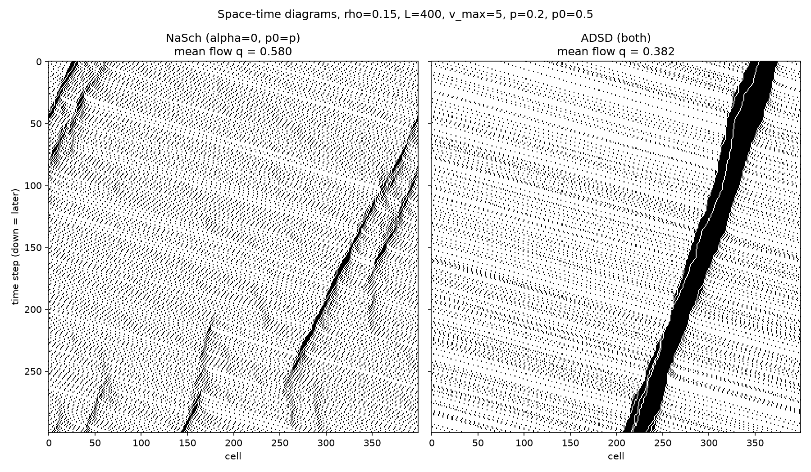
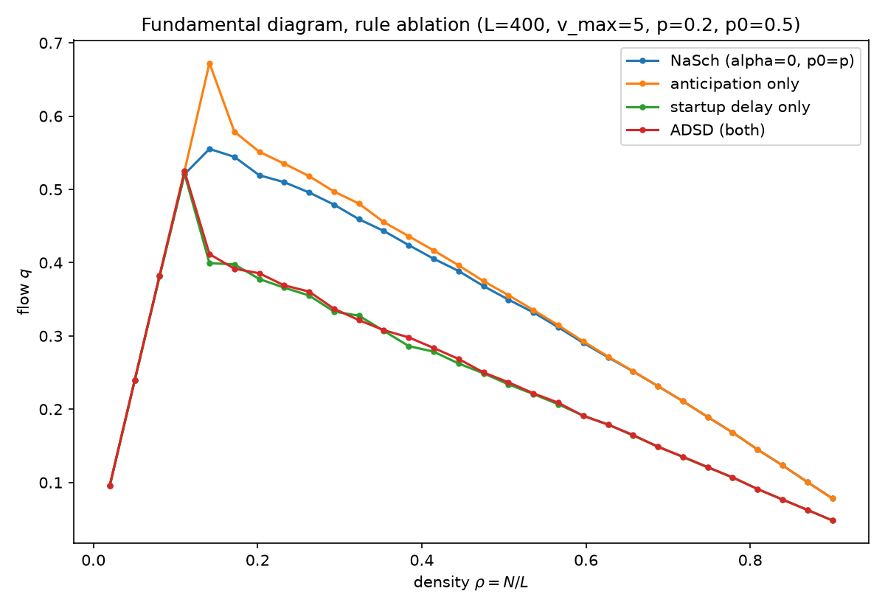

# Cellular Automaton Models of Traffic Flow

Senior capstone project (Mathematics, Fall 2026).

This project designs new cellular automaton (CA) rules for vehicular traffic, compares them against the classic **Nagel–Schreckenberg (NaSch)** model, and studies how traffic behavior (free flow, phantom jams, phase transitions) changes as the rules and the road geometry change.



## The model

A road is a ring of `L` cells. Each cell is empty or holds one car with an integer speed `0 … v_max`. At every time step, all cars update **simultaneously** using only local information.

### Baseline: NaSch (1992)
1. Accelerate: `v = min(v + 1, v_max)`
2. Brake: `v = min(v, d)` (where `d` = empty cells ahead)
3. Randomize: with probability `p`, `v = max(v − 1, 0)`
4. Move: `x = (x + v) mod L`

### New rules: ADSD (Anticipating Driver with Startup Delay)

Each car also looks at the car ahead: its speed `v_f` and its gap `d_f`.

| Rule | Update | Driver behavior it models |
|---|---|---|
| R1 Accelerate | `u = min(v + 1, v_max)` | Speed up when possible |
| R2 Anticipate | `g_f = max(min(v_f, d_f) − 1, 0)`, `d_eff = d + α·g_f` | Brake for where the car ahead *will be*, not where it is now |
| R3 Brake | `u = min(u, d_eff)` | Never hit the car ahead |
| R4 Hesitate | with prob. `p0` if stopped, `p` if moving: `u = max(u − 1, 0)` | Stopped drivers are slower to start (like at a green light) |
| R5 Move | `x = (x + u) mod L` | |

**Key design property:** setting `α = 0` and `p0 = p` recovers NaSch *exactly*. Every difference between the models can therefore be traced to a single switch (anticipation or startup delay).

**Collision-freeness:** the car ahead always moves at least `g_f` cells, so moving at most `d + g_f` cells is safe. The code also verifies this numerically at every step.

## Results so far

The fundamental diagram (flow vs. density) for four rule sets, turning each new rule on separately:



- **Anticipation** lets cars follow more closely, since each driver accounts for the car ahead also moving.
- **Startup delay** makes jams "stickier": stopped cars restart slowly, so congestion forms large, long-lived jams that move backward along the road (visible as dark diagonal bands in the space-time diagram above).

## Repository structure

| File | Purpose |
|---|---|
| `nasch_simulation.py` | NaSch baseline on a ring road (`RingRoadCA`) |
| `custom_rules.py` | ADSD rules (`CustomRingCA`), with collision checking |
| `check_rules.py` | Verification: ADSD reduces to NaSch, collision stress test, hand-trace table |
| `run_highway_comparison.py` | Generates the space-time and fundamental diagrams in `figures/` |

## Running it

```bash
python3 -m venv .venv
source .venv/bin/activate        # Windows: .venv\Scripts\activate
pip install -r requirements.txt

python check_rules.py            # tests + small trace table
python run_highway_comparison.py # writes figures/ (about 1 minute)
```

Parameters (`L`, `v_max`, `p`, `p0`) are set near the top of `run_highway_comparison.py`.

## Roadmap

- [x] NaSch baseline and ADSD rules on a ring highway
- [x] Verification and rule-by-rule comparison
- [ ] Parameter sweeps and phase-transition analysis
- [ ] T-intersection geometry (yielding rule)
- [ ] Merge / on-ramp geometry (gap-acceptance rule)
- [ ] Mean-field model for flow vs. density under ADSD
- [ ] Formal collision-freeness proof for every geometry

## References

1. K. Nagel and M. Schreckenberg, "A cellular automaton model for freeway traffic," *J. Phys. I France* 2 (1992), 2221–2229.
2. D. Chowdhury, L. Santen, and A. Schadschneider, "Statistical physics of vehicular traffic and some related systems," *Physics Reports* 329 (2000), 199–329.
3. R. Barlovic, L. Santen, A. Schadschneider, and M. Schreckenberg, "Metastable states in cellular automata for traffic flow," *Eur. Phys. J. B* 5 (1998), 793–800.
